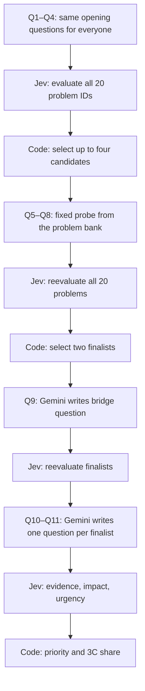

# Nkoyo adaptive assessment — architecture draft

The adaptive assessment runs at `/snapshot` in development and production. It stores its session in the browser's local storage and uses a server function for model calls. Production requires a Jev key.



## Who decides what

| Part | Owner | Rule |
| --- | --- | --- |
| Q1–Q4 | Fixed question bank | Three choice questions and one written example. |
| Problem evidence | Jev | Classifies each requested problem as insufficient information, contradicted, possible, or supported, with probabilities. |
| Q5–Q8 topic selection | Code | Ranks Jev evaluations; loads fixed probes by stable problem ID. Jev never writes these questions. |
| Q9 wording | Gemini | Writes one neutral open question about the two finalists. A fixed fallback is used on failure. |
| Q10–Q11 wording | Gemini | Writes one open question per finalist. Fixed fallbacks are used on failure. |
| Final result | Code + Jev | Jev supplies evidence and final impact/urgency signals. Code computes the ordering and 3C relative share. Gemini cannot change the result. |

No topic is forced when all 20 are contradicted or have insufficient evidence. If only one supported or possible topic remains after Q5–Q8, the engine finishes with that provisional finding and leaves impact/urgency unassessed.

## Result interpretation

The code currently uses a **draft**, unvalidated priority formula: 45% evidence support, 35% impact, and 20% urgency. Two finalists within 0.05 of each other are both listed as priorities. The 3C percentages describe the **relative share of modeled pressure** across Culture, Capacity, and Compliance. They are not probabilities that an organization has a problem and should not be presented as a validated score. The 20-to-3C mapping is also a draft and needs subject-matter review.

Each session records answers, evaluation rounds, candidate selection, generation fallback, and result calculation in `events`. The browser saves the session in local storage. If a visitor submits the optional report request, the app saves their email in `leads` and their completed answers, result, and report copy in `assessment_sessions`, linked by `session_key`. It does not send email. A server-backed store and rate limit are still needed for broader public use. Persist each stage on the server and send only current questions and result data to the browser. Do not put provider keys or the full evaluation log in client code in a public deployment.

## Provider configuration

The server adapters are `jev.server.ts` and `gemini.server.ts`. `services.server.ts` reads these environment variables:

```text
JEV_API_KEY=...
JEV_MODEL=jev-latest
GEMINI_API_KEY=...
GEMINI_MODEL=gemini-3.6-flash
```

Without a Jev key, the localhost preview uses a labeled, hand-written routing rule evaluator. It uses selected answers, fixed probe choices, and a few topic words in written responses. It is a UI review mode, not an AI assessment. Gemini is optional; without it, Q9–Q11 use fixed fallback prompts. Configure keys only on the server.

## Report requests

The optional email field on the adaptive result page captures a report request through the existing Supabase `leads` and `assessment_sessions` tables. Marketing consent is separate and unchecked. The app shows a saved confirmation only after both inserts succeed. The assessment is linked to the lead by `session_key`. No email provider is configured, so the visitor is told that no report has been sent. Before launch, connect a verified sender and email provider, add a delivery status/retry path, and review the report and privacy copy.

## Review before launch

1. Review the four opening questions and all 20 fixed probes with the Nkoyo team and test the wording with nonprofit leaders.
2. Review the 20 problem names, 3C mapping, evidence rubric, and result policy. Decide how to display inconclusive and single-topic outcomes.
3. Add a server-backed session store and a rate-limited assessment endpoint before enabling the adaptive UI in production. Persist each stage and event.
4. Run test responses through Jev and Gemini. Compare model choices with expert-reviewed examples, especially low-information and contradictory cases.

## Local checks

From this project directory after installing dependencies:

```powershell
npx tsc --noEmit
node --experimental-strip-types --test tests\assessment-v2.test.mjs tests\assessment-v2-providers.test.mjs
```
